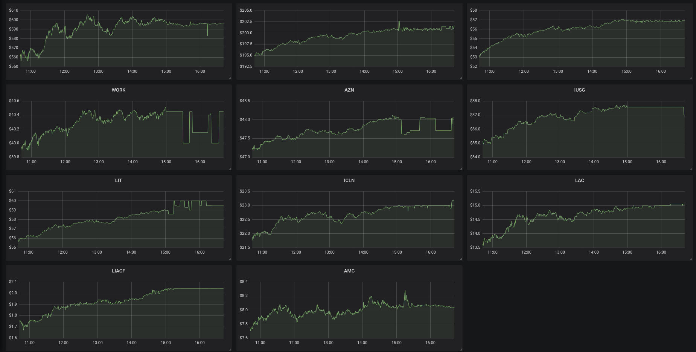

# Prometheus Stock Exporter

 * A prometheus exporter than exposes live stock prices as prometheus metrics.
 * The stocks to be tracked can be added to the config.json file

### Run
---
* Run it with docker (recomended) 
    - `docker build -t stock-expoter . `
    - `docker run -d -p 2112:2112 stock-expoter`

* The metrics should be visible on `http://localhost:2112/metrics`
* Example output
 ```# TYPE stock_tracker gauge
stock_tracker{ticker="AMC"} 8.03
stock_tracker{ticker="AZN"} 47.71
stock_tracker{ticker="ICLN"} 22.97
stock_tracker{ticker="IUSG"} 87.57
stock_tracker{ticker="LAC"} 15.05
stock_tracker{ticker="LIACF"} 2.04
stock_tracker{ticker="LIT"} 59.47
stock_tracker{ticker="LUV"} 56.885
stock_tracker{ticker="TSLA"} 595.805
stock_tracker{ticker="VTI"} 201
stock_tracker{ticker="WORK"} 40
```

### Visualize 
---
* Visualized on Grafana

